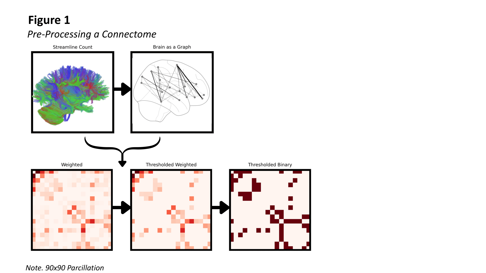

# Networks and Graphs

## What is a Network?

Generative network models describe the pattern of connectivity between areas in the brain using a mathematical framework called a [graph theory](glossary.md#graph). Graph theory gives us a language for describing and characterising [graphs](glossary.md#graph). [Graphs](glossary.md#graph) (also known as [networks](glossary.md#network)) consist of a set of [nodes](glossary.md#node) with [edges](glossary.md#edge) which form connections between pairs of those nodes. This framework can be used to describe many different real-world systems. The Web forms a [network](glossary.md#network) in which [nodes](glossary.md#node) represent webpages and the [edges](glossary.md#edge) between those nodes represent hyperlinks between the webpages. Alternatively, each of our [nodes](glossary.md#node) could represent a species (extant or extinct), with edges between immediate ancestor-descendent pairs. Graphs can also be used to describe abstract relationships; for example, each of our [nodes](glossary.md#node) could be a chess board, with [edges](glossary.md#edge) between boards if there is a legal move by either player which takes us from one board to another.     

By describing a system as a network, we can capture the pattern of connectivity between elements while abstracting away the detials of both how the system is implemented and the identity or properties of individual nodes beyond the connections they make. When we describe the web as a [network](glossary.md#network), and each webpage as a [node](glossary.md#node), we are abstracting away from all the other details about each webpage - for example, the colour scheme it uses, what text it contains, and whether it contains any images or videos.

<!-- 
 In these examples, the network structure captures the fundamental pattern of connectivity whilst abstracting away many physical details. This simple yet powerful representation allows us to capture the essential structure of complex systems by focusing on the relationships between components rather than the components themselves. Networks can be either weighted or unweighted: unweighted networks contain [edges](glossary.md#edge) that are simply present or absent, whilst weighted networks have [edges](glossary.md#edge) with different strengths or capacities.

Networks capture abstract structure in a way that allows two real, physical systems to have identical network representations despite having very different physical instantiations. For instance, a social network of friendships and a network of protein interactions might both exhibit the same mathematical properties, such as small-world connectivity or scale-free degree distributions, even though one describes human relationships and the other molecular interactions. -->

## Brains as Networks

In order to represent the brain as a network, we must divide the brain up into distinct regions which can serve as [nodes](glossary.md#node). This division is called a [parcellation](glossary.md#parcellation). There are several types of parcellations commonly used in network neuroscience. Cortical parcellations divide the cortical surface into regions based on anatomical landmarks or functional properties, whilst volumetric parcellations partition the entire brain volume including subcortical structures. Cytoarchitectural parcellations rely on differences in cellular organisation and structure between brain regions, whilst connectivity parcellations group regions based on similar patterns of connections with other brain areas. Common parcellation schemes include the Automated Anatomical Labelling (AAL) atlas, which provides a standardised parcellation based on anatomical landmarks, and the Schaefer parcellation, which uses functional connectivity to define cortical regions at multiple scales.

Once the brain has been parcellated into areas represented by [nodes](glossary.md#nodes), we must determine the pattern of [edges](glossary.md#edge) between those nodes, representing connectivity between brain regions. [Structural connectivity](glossary.md#structural-connectivity) refers to the physical connections between areas formed by white matter tracts. [Structural connectivity](glossary.md#structural-connectivity) can be measured using techniques such as diffusion tensor imaging (DTI) and tractography. In contrast, [functional connectivity](glossary.md#functional-connectivity) captures statistical relationships between the activities of different brain regions, for example, through the correlation in measured neural activity. Typically, we think of Generative Network Models as models of [structural connectivity](glossary.md#structural-connectivity); however, they can also be applied to model [functional connectivity](glossary.md#functional-connectivity). 

To determine [structural connectivity](glossary.md#structural-connectivity), it is typical to use diffusion MRI (magnetic resonance imaging). Diffusion MRI can be used measure the diffusion of water molecules throughout the brain. Tractography algorithms can then reconstruct the paths that white matter tracts make through the brain on the basis of this diffusion data. For example, streamline count gives the number of reconstructed fibre bundles connecting pairs of regions.

Reconstructions of [structural connectivity](glossary.md#structural-connectivity) data are typically then post-processed. Data can be combined across multiple subjects or scanning sessions to create robust group-level connectivity estimates called a consensus network. Thresholding removes weak connections that may represent noise, using either absolute thresholds (removing connections below a fixed strength) or relative thresholds (keeping only the strongest connections). By default the connecivity thereby obtained will be [weighted](glossary.md#weight-matrix), meaning that strenghts are assigned to each edge in accordance with the estimated size of the white matter tract between those regions. Binarisation can convert this into a [unweighted](glossary.md#adjacency-matrix) network by ignoring strength estimates, and setting all remaining connections to have a value of $1$, and all absent connections a value of $0$. 

## Representing Networks

A useful representation of an unweighted network is via its [adjacency matrix](glossary.md#adjacency-matrix-a), denoted $A$. When two nodes have an edge between them, we say they are [adjacent](glossary.md#adjacent). [Adjacency matrices](glossary.md#adjacency-matrix) captures which nodes are adjacent as follows: if [nodes](glossary.md#node) $i$ and $j$ are connected by an [edge](glossary.md#edge), we set $A_{ij} = A_{ji} = 1$. Conversely, when no such edge exists we set $A_{ij} = A_{ji} = 0$. The [adjacency matrix](glossary.md#adjacency-matrix) is therefore [binary](glossary.md#binary-generative-network-model), in the sense that it contains only $0$s and $1$s, as well as [symmetric](glossary.md#symmetric), meaning $A_{ij} = A_{ji}$. 

The [adjacency matrix](glossary.md#adjacency-matrix-a) representation has several useful mathematical properties. The [degree](glossary.md#degree) of a [node](glossary.md#node) is the total number of edges that node is at the end of. To compute the degree of $s_i$ of node $i$, we can sum over each node $j$ within the network, and add a $1$ if $j$ is adjacent to $i$ or a zero if not. The degree is therefore $s_i = \sum_j A_{ij}$. Likewise, powers of the [adjacency matrix](glossary.md#adjacency-matrix-a) give  connectivity information beyond direct connections (adjacency). For example, take two nodes $i$ and $j$. A [path](glossary.md#path) between $i$ and $j$ is a sequence of nodes which starts with $i$ and ends with $j$ such that each pair of nodes is adjacent. Accordingly, $i$ and $j$ are adjacent if there is a path of length $1$ between them, $i,j$. So $A_{ij}$ captures the presence of paths of length $1$. Paths are a useful way of quantifying *indirect* connectivity between nodes, with paths of increasing length as less preferable communication pathways. The number of paths of length $2$ between $i$ and $j$ is equal to the number of nodes $k$ in the network such that $i$ is adjacent to $k$ and $k$ is adjacent to $j$. So to compute the number of such paths, we simply sum over nodes $k$ in the network, and add $1$ if both $A_{ik}$ and $A_{kj}$. This is simply $\sum_k A_{ik} A_{kj} = [A^2]_{ij}$, where we have used the definition of matrix multiplication. A similar argument reveals that higher powers continue this patter; $[A^n]_{ij}$ gives the number of paths between $i$ and $j$ which have length $n$. As a special case of this, $(1/2) [A^3]_{ii}$ counts the number of triangles which $i$ is involved in (the factor of $(1/2)$ accounts for the fact that $i,j,k,i$ and $i,k,j,i$ are the same triangle). 

When the edges within a network have weights, we can instead use a [weight matrix](glossary.md#weight-matrix-w), denoted $W$. This generalises the [adjacency matrix](glossary.md#adjacency-matrix-a) by allowing $W_{ij}$ to take any non-negative value representing the strength of the connection between [nodes](glossary.md#node) $i$ and $j$. Like the [adjacency matrix](glossary.md#adjacency-matrix-a), the [weight matrix](glossary.md#weight-matrix-w) is typically [symmetric](glossary.md#symmetric). When $W_{ij} = 0$, no connection exists between the [nodes](glossary.md#node); when $W_{ij} > 0$, the magnitude indicates the strength of the connection. The [weight matrix](glossary.md#weight-matrix-w) preserves all the structural information of the [adjacency matrix](glossary.md#adjacency-matrix-a) while providing additional detail about connection strengths. Many network measures can be adapted from binary to weighted versions by incorporating these connection strengths into the calculations. 

## Network Measures

### Node-Level Measures

The [degree](glossary.md#degree) of a [node](glossary.md#node) represents the most basic measure of its connectivity, counting the total number of [edges](glossary.md#edge) attached to that [node](glossary.md#node). In brain networks, [degree](glossary.md#degree) indicates how many other regions a particular brain area connects to directly. High-[degree](glossary.md#degree) [nodes](glossary.md#node) often serve as hubs in the network, facilitating communication between many different regions. [Degree](glossary.md#degree) is one example of a node-level network measure. These are properties of indivdual nodes (or sometimes, edges), which provide a quantification of a property of that nodes, such as (in this case) its overall level of connectivity. Here and below we discuss various network measures at both the node-level and network-level which are used in the Generative Network Model.  

The [clustering coefficient](glossary.md#clustering-coefficient) of a [node](glossary.md#node) measures the extent to which it is at the centre of a local cluster of nodes. The clustering coefficient is larger when the [neighbours](glossary.md#neighbour) of a node are also connected to one another. Specifically, the clustering coefficient is the proportion of possible [edges](glossary.md#edge) between a [node's](glossary.md#node) [neighbours](glossary.md#neighbour) that are actually present. For [node](glossary.md#node) $i$, the clustering coefficient is equal to the number of connections between $i$'s neighbours divided by the number of pairs of neighbours. The number of connections between $i$'s neighbours is simply the number of triangles in which $i$ is a vertex, since if two of $i$'s neighbours $j, k$ are connected then $i, j, k$ are all connected and therefore form a triangle. The possible number of connections between $i$'s neighbours is the same as the number of *pairs* of $i$'s neighbours. To find the number of pairs of $i$'s neighbours, we first count the number of neighbours $j$ of $i$ (which is equal to the degree of $i$, $s_i$), and then multiply by the number of neighbours $k$ of $i$ which are not $j$ (which will be $s_i - 1$). We then divide by $2$ to account for the fact that this counts the pair $j,k$ twice (as $j,k$ and $k,j$). Thus, the number of neighbours is $s_i(s_i - 1)/2$. Putting this together, the clustering coefficient is
$$
c_i = \frac{ (A^3)\_{ii}/2 }{ s_i(s_i -1)/2 } = \frac{ (A^3)\_{ii} }{s_i(s_i - 1)}.
$$
High [clustering](glossary.md#clustering-coefficient) indicates that a [node's](glossary.md#node) [neighbours](glossary.md#neighbour) form a tightly interconnected local community.

[Betweenness centrality](glossary.md#betweenness-centrality) of a [node](glossary.md#node) $i$ measures how vital that node is for information flow through the network. Specifically, betweenness centrality is a measure of how often $i$ sits on the [shortest paths](glossary.md#shortest-path) between other [nodes](glossary.md#node) in the [network](glossary.md#network). A [shortest path](glossary.md#shortest-path) between nodes is a [path](glossary.md#path) which contains the least number of edges of any path connecting those nodes. For each pair of other [nodes](glossary.md#node) $j,k \neq i$ in the [network](glossary.md#network), we identify all [shortest paths](glossary.md#shortest-path) connecting them. We then compute the faction of these shortest paths which pass through $i$. We then sum (or average) this fraction across all pairs of other nodes within the network to compute the [betweenness centrality](glossary.md#betweenness-centrality). This measure identifies [nodes](glossary.md#node) that serve as important bridges or bottlenecks for information flow, even if they do not have particularly high [degree](glossary.md#degree).

### Network-Level Measures

Network-level measures serve as summary statistics that characterise the properties of an entire [network](glossary.md#network) at a high level. These measures provide a way to quantify and compare different aspects of network organisation while abstracting from the lower-level details of the exact connectivity pattern. In this way, they are analogous to measures of location (such as the mean) and measures of central tendency (such as the variance), which summarise important features of a dataset. 

The global [clustering coefficient](glossary.md#clustering-coefficient) of a [network](glossary.md#network) is computed as the average [clustering coefficient](glossary.md#clustering-coefficient) across all [nodes](glossary.md#node). This measure indicates the overall tendency for [nodes](glossary.md#node) in the [network](glossary.md#network) to form locally clustered communities. High global [clustering](glossary.md#clustering-coefficient) suggests a [network](glossary.md#network) organisation that supports local processing and segregated function.

Network density $\rho$ measures the proportion of possible [edges](glossary.md#edge) that are actually present in the [network](glossary.md#network). This is equal to the number of edges in the network dvided by the number of pairs of nodes in the network. If there are $N$ nodes and $E$ edges, then (by a similar argument to the above) this is
$$
\rho = \frac{\text{Number of edges}}{\text{Number of pairs of nodes}} = \frac{E}{N(N-1)/2} = \frac{2E}{N(N-1)}.
$$ 
Density provides a simple measure of how extensively connected a [network](glossary.md#network) is, with values ranging from 0 (no connections) to 1 (completely connected).

The [characteristic path length](glossary.md#characteristic-path-length) represents the average [shortest path](glossary.md#shortest-path) length across all pairs of [nodes](glossary.md#node) in the [network](glossary.md#network). This provides a measure of the typical number of steps required to travel between any two [nodes](glossary.md#node), quantifying tthe global efficiency of the [network](glossary.md#network) for information transmission. Lower [characteristic path length](glossary.md#characteristic-path-length) indicates more efficient global connectivity.

<!-- ## Distance and Network Structure

In the case of a brain  

Physical distances between brain regions, stored in a [distance matrix](glossary.md#distance-matrix-d), play a fundamental role in shaping connection patterns due to principles of wiring economy. Longer connections require more resources to establish and maintain, making them metabolically costly and developmentally challenging to form. This creates a natural bias toward shorter connections in biological networks.

The [edge length](glossary.md#edge-length) [distribution](glossary.md#distribution) describes how connection distances are distributed across the [network](glossary.md#network). This [distribution](glossary.md#distribution) typically shows an overrepresentation of short connections compared to what would be expected from random wiring, reflecting the influence of spatial constraints on network formation. For [edges](glossary.md#edge) connecting [nodes](glossary.md#node) $i$ and $j$, the [edge length](glossary.md#edge-length) is given by $D_{ij}$, where $D$ is the [distance matrix](glossary.md#distance-matrix-d).

Understanding the relationship between physical distance and connection probability is essential for interpreting generative network models, which explicitly incorporate spatial constraints through distance-dependent wiring rules. The interplay between spatial constraints and topological factors determines the final structure of brain networks, balancing the efficiency benefits of short connections against the functional requirements for longer-range integration.

### Topological vs Topographical Measures

An important distinction exists between [topological](glossary.md#topology) and [topographical](glossary.md#topography) network measures. [Topological](glossary.md#topology) measures depend only on the pattern of connections within the [network](glossary.md#network), ignoring the physical positions of [nodes](glossary.md#node) in space. Examples include [degree](glossary.md#degree), [clustering coefficients](glossary.md#clustering-coefficient), and [shortest path](glossary.md#shortest-path) lengths. In contrast, [topographical](glossary.md#topography) measures incorporate information about the spatial locations of [nodes](glossary.md#node) and the physical distances between them. [Edge length](glossary.md#edge-length) distributions exemplify [topographical](glossary.md#topography) measures, as they depend on both the presence of connections and the spatial arrangement of [nodes](glossary.md#node). -->
